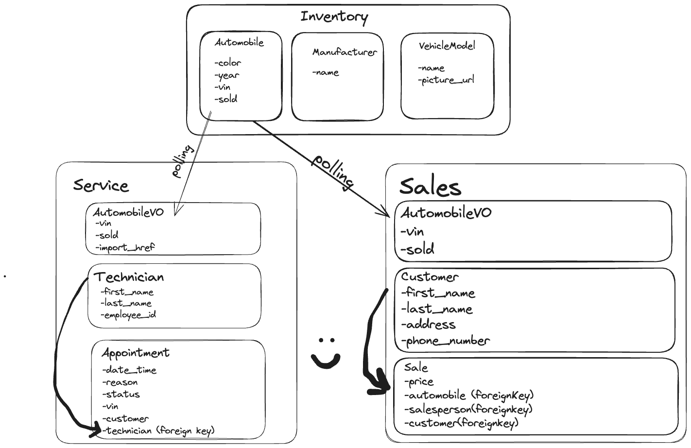

# CarCar

Team:

* Jake Enger - Sales master
* Sarah - Services

## How to Run this App
1. clone Project Beta from GitLab
2. git clone "project"
3. docker volume create beta-data
4. docker-compose build
5. docker-compose up

## Diagram:

## API Documentation
Example of JSON Body for Create Service Appointment:
{
	"reason": "flat tire",
	"vin": "5164651564",
	"customer": "Steve",
	"technician": 10,
	"date_time": "2023-09-25 06:00"
}
Example of JSON Body for Create Technician:
{
	"employee_id": 5678,
	"first_name": "Sarah",
	"last_name": "Corkum"
}

## URLs and Ports
Service microservice:
- List service appointment: http://localhost:8080/api/appointments/
- Delete service appointment: http://localhost:8080/api/appointments/<int:pk>/
- Create service appointment: http://localhost:8080/api/appointments/
- Finish service appointment: http://localhost:8080/api/appointments/<int:pk>/finish/
- Cancel service appointment: http://localhost:8080/api/appointments/<ing:pk>/cancel/
- Delete technician: http://localhost:8080/api/technicians/<int:pk>/
- Create technician: http://localhost:8080/api/technicians/
- List technicians: http://localhost:8080/api/technicians/

## Service microservice

Explain your models and integration with the inventory
microservice, here.

The service microservice has a Technician model, AutomobileVO model, and Appointment model. The AutomobileVO is a value object based on the inventory's Automobile model. The Automobile model and AutomobileVO model are in two different bounded contexts. The poller is pulling the automobile data from the inventory API and giving it to the AutomobileVO model. The Appointment model in the service microservice has a technician property. This technician data comes from the Technician model in the service microservice.

## Sales microservice

Explain your models and integration with the inventory
microservice, here.

## Value Objects
-AutomobileVO
